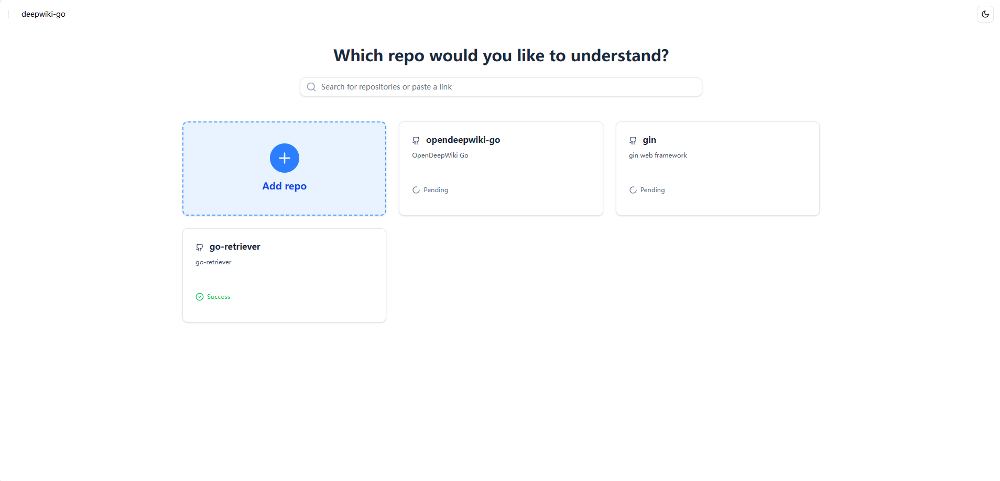
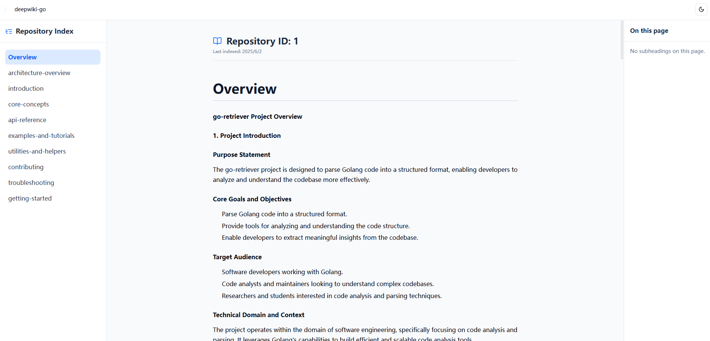

# OpenDeepWiki

OpenDeepWiki is an AI-driven documentation system that automatically generates comprehensive documentation for code repositories.

## Features

- Submit Git repositories for automatic documentation generation
- Asynchronous processing of documentation tasks
- RESTful API for task submission and status checking
- YAML-based configuration
- Modular API structure
- SQLite database for persistent storage
- Automatic task recovery after server restart

## Getting Started

### Prerequisites

- Go 1.21 or later
- Git

### Installation

1. Clone the repository:
```bash
git clone https://github.com/o0olele/opendeepwiki-go.git
cd opendeepwiki-go
```

2. Install dependencies:
```bash
go mod tidy
```

3. Build the project:
```bash
go build -o opendeepwiki ./cmd/server/
```

### Configuration

The application uses a YAML configuration file. By default, it looks for `config.yaml` in the current directory. You can specify a different configuration file using the `CONFIG_FILE` environment variable.

Example configuration file:
```yaml
# OpenDeepWiki Configuration

# Server settings
server:
  address: ":8080"
  
# Repository settings
repository:
  dir: "./data/repos"
  code: "./data/code"
  vector: "./data/vector"

# Database settings
database:
  path: "./data/sqlite/opendeepwiki.db" 

# LLM settings
llm:
  provider_type: openai # support llama.cpp/openai/google
  api_key: sk-xxxx
  model: qwen3-14b
  base_url: https://dashscope.aliyuncs.com/compatible-mode/v1

# Embedding settings
embedding:
  provider_type: llamacpp # support llama.cpp/openai
  api_key: sk-none
  model: text-embedding-v3
  base_url: http://192.168.97.93:8080
```

### Running the Server

```bash
./opendeepwiki
```

### ScreenShots




## TODO

- [ ] Delete repository
- [ ] Update repository manually
- [ ] Chat with the document
- [ ] Markdown toc
- [ ] Markdown export


## License

This project is licensed under the MIT License - see the LICENSE file for details. 